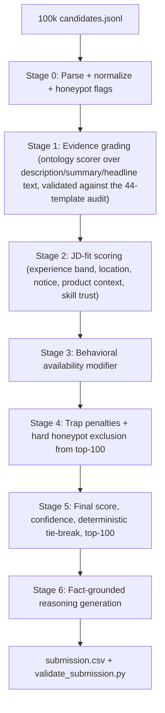

# Redrob Candidate Ranking Strategy — v2 (data-verified)

v1 was written from the docs alone. v2 incorporates a full read-only EDA of all 100,000 candidates, which changed several load-bearing decisions. Everything quantitative below was measured, not assumed.

## 1. The decisive dataset discovery

**The entire pool is built from 44 canonical `career_history.description` templates.** Across ~300k role entries there are exactly 44 distinct description strings, parameterized nowhere. Frequency tells the story:

- **T0-T8** (~25k uses each): non-tech archetypes — enterprise sales, customer support, B2B marketing, consulting BA, brand design, mechanical engineering, accounting, content/SEO, logistics ops. These carry the keyword-stuffer trap population (relevance tier 0-1).
- **T9-T14** (~10k each): general software — DevOps, Android, frontend, Java backend, full-stack, QA (tier 1).
- **T15-T20** (~1.8k each): data engineering / analytics / backend-data hybrid (tier 2).
- **T21-T26** (~330-390 each): ML-adjacent — fraud-ML production engineer, lightweight recsys, **CV-primary (T23, explicitly a JD negative)**, time-series, churn modeling, NLP classification pipelines (tier ~3).
- **T27-T32** (~57-78 each): strong production ranking/search/recsys/RAG/MLOps work (tier ~4).
- **T33-T38** (2-12 each): elite, explicit retrieval+ranking at scale — T34 literally describes a recruiter-facing hybrid BM25+dense+LLM-reranker search product (the JD's dream candidate) (tier 5).
- **T39-T43** (2-9 each): **plain-language tier 5** — "built systems that surface relevant content", "overhauled the matching layer" — zero AI keywords. This is the trap the JD's participant note describes. Only ~24 role entries across 8-14 candidates carry these.

Consequences:

- **Only 179 candidates carry any strong template (T27-T43).** The top-100 is nearly determined: include all eligible strong-template candidates, exclude the honeypots hiding among them, backfill with the best ML-adjacent (T21-T26) candidates, and get the top-10 ordering right. All of NDCG@10 (50% weight) is decided within a ~179-candidate set.
- Semantic embedding search is **unnecessary**: with a 44-string text universe, we can hand-audit every template against the JD with certainty. This removes the v1 embedding precompute (torch, model artifacts, Stage-3 reproduction risk) entirely.
- The 8 identified plain-language candidates (e.g. `CAND_0006567` — Senior AI Engineer, Noida, 7.9y, templates T39/T42/T40, active 3 weeks ago, 0.79 response rate) are exactly what keyword-only competitors will miss.

## 2. Corrections to v1 (things the data disproved)

- **Company names are randomized noise.** Fictional companies (Pied Piper, Dunder Mifflin, Hooli...) and Infosys/Wipro/TCS each appear ~23,500 times, independent of descriptions. v1's "CompanyType from company/industry fields" feature would have **corrupted** the ranking. Product-vs-services context must be read from description text ("at a product company", "consumer product", "marketplace"), where the template authors deliberately encoded it. The JD's "entirely at consulting firms" disqualifier likewise maps to the consulting **template** (T3), not to employer names.
- **Degree-ordering is not a honeypot rule.** 1,752 candidates have a PhD ending before their Bachelor's — ~22x the entire honeypot budget (~80). It's generator noise. v1 would have mass-flagged innocents; demote to (at most) a negligible signal.
- **Honeypot families, measured:** 25 candidates claim YoE exceeding their career-date span by >2 years (**8 of these sit inside the strong-template pool** — claimed 15-17y vs actual 4-8y spans — these are the dangerous ones designed to crack the top-10); 21 have ≥3 "expert" skills with 0 months used; 177 have impossible tenure at real companies (e.g. at CRED before its 2018 founding). Union ≈ 221 vs a stated ~80 honeypots, so flags are penalties with calibrated thresholds, not automatic proof — but any flagged candidate is excluded from the submitted top-100 (excluding a borderline tier-3 costs ~nothing; including a honeypot risks disqualification).
- **Behavioral twins confirmed and repurposed.** Found 5 pairs of strong candidates with identical template sets, titles, and YoE, differing only in engagement signals (response rate 0.88 vs 0.60, open-to-work true vs false). The ground truth almost certainly tiers them apart by availability — so behavioral signals are a **scored ranking input within evidence tiers**, not just a tiebreak.
- **Deterministic time anchor.** "Today" must be derived from the dataset (max `last_active_date` = 2026-05-27), never wall-clock, or activity-recency scores change between runs — a Stage-3 reproducibility hazard.

## 3. Architecture



Pure Python + numpy. No torch, no network, no model artifacts. Measured full-pool parse takes ~30s; total pipeline well under 1 minute — a 5x safety margin on the 5-minute budget and a strong talking point at interview.

**Generalizability posture (important for defense):** the shipped scorer is a *general* ontology/lexical evidence scorer that works on arbitrary text — the sandbox must rank unseen small samples. The 44-template audit is used as an **exhaustive validation set** (unit tests assert the scorer grades every template correctly), not as a hardcoded lookup. No candidate IDs are ever hardcoded. This is both honest ("we discovered the text universe is small enough to audit exhaustively") and robust.

## 4. Scoring formulation

```
FinalScore = EvidenceGrade                       # dominant term, 0-1, from graded description evidence
           × (1 + α·JDFit)                       # α ≈ 0.3; experience band, location, notice, product context, skill trust
           × BehavioralModifier                   # ~[0.6, 1.1]; activity recency, response rate, open-to-work, interview completion
           × TrapPenalty                          # (0,1]; stuffer/mismatch/soft-flag penalties
   with HardExclusion from top-100 for calibrated honeypot flags
```

- **EvidenceGrade** (what you did): recency-weighted max/blend over per-role evidence scores. Recent strong role >> ancient strong role. Includes the JD's negative evidence: CV-primary (T23-like text) without NLP/IR down-weighted; consulting/BA-only careers down-weighted; "stopped coding 18+ months" (recent roles pure management text) down-weighted.
- **JDFit** (who fits the logistics): YoE soft-peak at 6-8 (band 5-9, JD's "ideal candidate"); location tiering Pune/Noida > Hyderabad/Mumbai/Delhi-NCR/Bangalore > rest of India > abroad+willing-to-relocate > abroad (75% of the pool is India; 159/179 strong candidates are India-based, so this mostly orders the top); notice ≤30d bonus per JD's buy-out note; salary-band sanity; skill trust cross-checked against `skill_assessment_scores` and `duration_months`.
- **BehavioralModifier**: months-since-active (anchored to 2026-05-27), `recruiter_response_rate`, `open_to_work_flag`, `interview_completion_rate` — implements the JD's explicit "down-weight the unreachable perfect-on-paper candidate" instruction and separates the twin pairs.
- **Tie-breaking (validator-compliant):** score desc → evidence grade desc → behavioral score desc → `candidate_id` ascending. Deterministic, satisfies the equal-score/ascending-ID rule in `validate_submission.py`.

## 5. Local evaluation harness (new — v1's biggest gap)

The JD itself demands "hands-on experience designing evaluation frameworks for ranking systems" — we build one for our own ranker:

- Construct a **proxy ground truth**: tier per candidate from the template audit (best template carried, adjusted for honeypot flags and the JD's behavioral note).
- Compute NDCG@10, NDCG@50, MAP, P@10 of our output against the proxy — the exact competition composite.
- Use it for **weight sensitivity sweeps** (does the top-10 flip if α moves ±50%? robust configurations preferred), ablation reporting (evidence-only vs +behavior vs +JD-fit), and regression testing across code changes.
- Explicitly documented as a proxy (assumes our template grading matches hidden tiers) — honest framing for Stage 4/5, and a centerpiece slide for the methodology presentation.

## 6. Honeypot defense (calibrated, not paranoid)

- Flags: YoE > career-span + 2y; ≥3 expert-proficiency skills with 0 `duration_months`; tenure predating a real company's founding year (curated list: CRED 2018, Razorpay 2014, Swiggy 2014, Meesho 2015...); heavily overlapping full-time stints; "expert in 10 skills, 0 assessments" pattern.
- Any flagged candidate is **excluded from the submitted 100** (union is ~221 candidates; at most ~30 of those would otherwise score near the top, so the cost is tiny and the >10%-honeypot disqualification risk drops to ~zero).
- Keyword-stuffers (AI-heavy `skills[]`, zero text evidence — only ~20 exist at high severity) score ~0 EvidenceGrade automatically since we never score the raw skills list for evidence; the TrapPenalty additionally marks them.
- Report the honeypot audit in the presentation with concrete examples (e.g. the 8 strong-template YoE-inflation candidates) — judges built these traps and will love seeing them caught.

## 7. Reasoning generation (Stage-4 defense)

Fact-slotting from verified profile fields only: YoE, current title, a phrase quoted/paraphrased from their actual role description, one behavioral number (response rate / last-active), and **one honest concern** (notice period 120d, based abroad, CV-heavy background, adjacent-not-core experience). Tone tracks rank: top-10 confident, 40-70 hedged, 90-100 explicitly "filler beyond cutoff" (mirroring the spec's own example). Rotating sentence frames prevent template detection; a hallucination guard asserts every named skill/employer exists in the profile before writing the row.

## 8. Compute, repo & submission mechanics

- **Single command:** `python rank.py --candidates ./candidates.jsonl --out ./submission.csv`. No precompute step at all (v1's embedding artifact eliminated). Dependencies: Python stdlib + numpy (+ pytest for tests). Deterministic: no RNG, stable sorts, dataset-anchored dates.
- **Modular `src/`**: `parse.py`, `evidence.py`, `traps.py`, `jdfit.py`, `behavior.py`, `score.py`, `reasoning.py`, `evaluate.py` — each a pure function over typed dicts, each unit-tested. This satisfies "modular, scalable, explainable" and makes the Stage-5 interview trivial to defend.
- **Sandbox:** Streamlit Cloud or HF Space wrapping the same `rank.py` on an uploaded ≤100-candidate sample (works on unseen data because the scorer is general).
- **Git history:** commit per module with real iteration (EDA notebook → template audit → scorer → traps → eval harness → tuning), matching Stage 4's "real iteration vs single dump" check.
- **Pre-submission checklist:** run `validate_submission.py`; verify exactly 100 rows, ranks 1-100, non-increasing scores, ascending-ID ties; verify 0 flagged honeypots in the CSV; runtime + memory print in README.

## 9. Ambiguities & risk register

- **Do hidden tiers incorporate behavior/location, or only evidence?** Unknown. Safe default: evidence dominates (multiplier structure caps behavioral influence at ~±30%), so a mis-weighted modifier reshuffles within tiers but never demotes a tier-5 below a tier-3. The twin pairs strongly suggest behavior does matter.
- **~80 stated honeypots vs ~221 flagged.** Our flags over-cover. Since we only need honeypots *out of our top-100* (not identified globally), over-exclusion of borderline candidates is nearly free. Documented as a deliberate asymmetric-cost decision.
- **Template-audit overfit optics.** Mitigated by shipping the general scorer + using the audit purely as validation; framed at interview as "we discovered the corpus is exhaustively auditable and made verification total instead of sampled."
- **Exactly 100 strong rows may not exist** after exclusions (~150-170 viable strong candidates measured, so likely fine); backfill order from T21-T26 (excluding T23-CV-primary unless NLP evidence coexists) is pre-decided and eval-harness-tested.
- **JD's "5-9 years"**: treated as soft band per the JD's own words ("a range, not a requirement"), with the 6-8 ideal as the peak — never a hard filter.

## 10. Why this wins

- **It plays the actual game.** The composite is decided inside a 179-candidate strong pool; we identified that pool, the 8 honeypots inside it, and the 8 plain-language tier-5s that keyword and naive-embedding systems will both misrank.
- **Embedding-reflex competitors** rank stuffers high and miss T39-T43; **keyword competitors** miss them too; both carry honeypots into the top-10. Our evidence-first grading catches all three trap families by construction.
- **Every judged criterion is engineered for**: explainability (44-template audit + per-candidate reasoning), quality (local NDCG harness + sensitivity sweeps), clarity (modular pipeline + methodology deck), Stage-3 reproduction (pure Python, <1 min, no artifacts), Stage-5 defense (every number in this plan is measured and re-derivable live).
